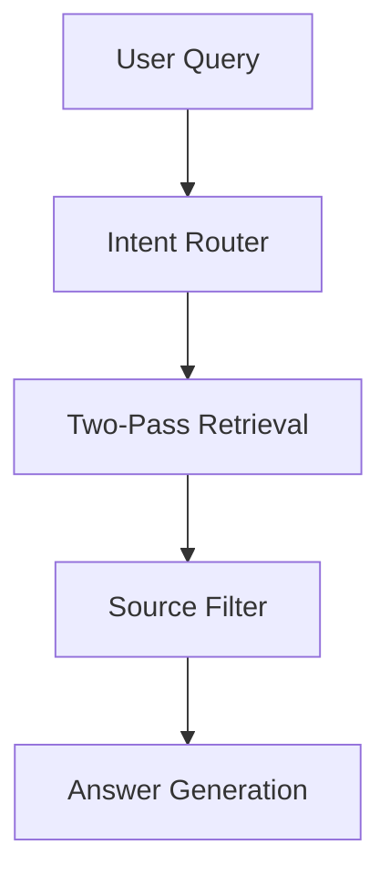
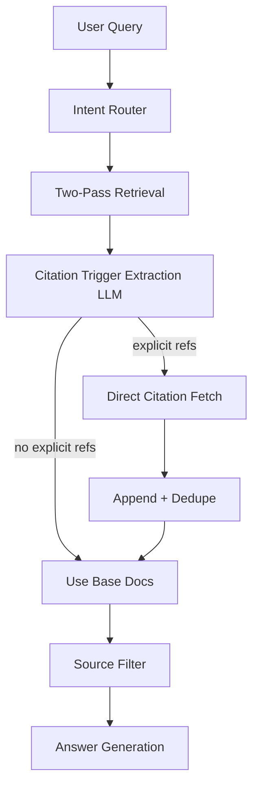
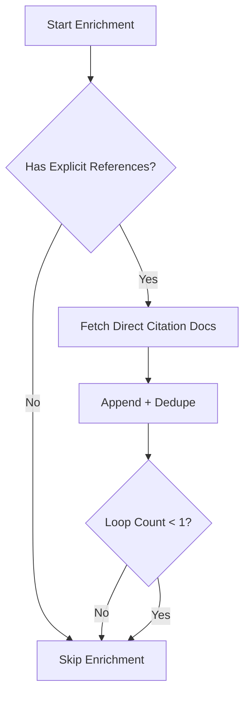
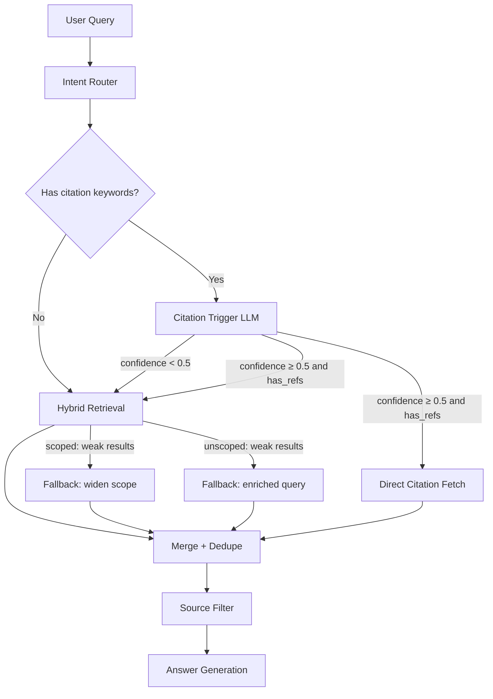
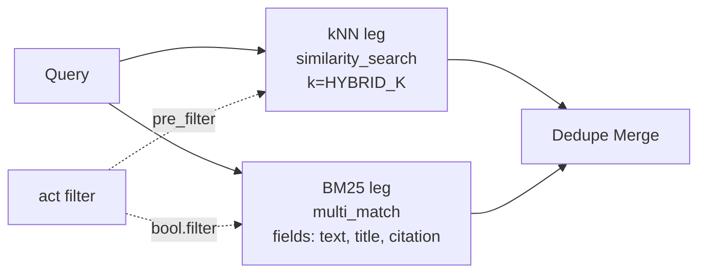
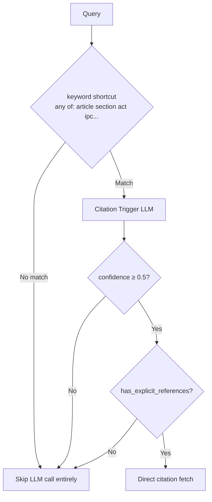

# Retrieval Enrichment Changes

## Purpose
This document tracks retrieval architecture changes for trigger-aware citation enrichment and phased rollout decisions.

## Phase Status
- Phase 1: Implemented ✅
- Phase 2: Implemented ✅
- Phase 3: Planned

## What Changed in Phase 1
- Added LLM-based explicit citation trigger extraction for Article/Section/Act references.
- Added direct citation fetch queries generated from extracted references.
- Added merge policy: append direct citation docs to retrieved docs, then dedupe.
- Added hard loop cap: a single enrichment loop maximum.
- Kept downstream usefulness filtering and answer generation flow unchanged.

## Files Changed
- core/schema.py
- core/prompts.py
- core/chain.py

## Architecture Delta (Before vs After)

## Loop Guard

## What Changed in Phase 2
- Replaced multi-subquery two-pass retrieval (10-14 sequential DB calls) with a single hybrid retrieval path.
- Hybrid search runs two legs per call: **kNN** (semantic, via `similarity_search`) and **BM25** (keyword, via OpenSearch `multi_match`) then merges and dedupes.
- Scope filter pushed into OpenSearch query at call time (`term` filter on `metadata.act_abbrev.keyword`) instead of Python post-processing.
- If scoped primary returns fewer docs than `HYBRID_FALLBACK_THRESHOLD`, falls back to one unscoped hybrid call (sets scope_warning).
- If unscoped primary is also weak, runs one fallback call with an enriched query string (`"{intent} India law {query}"`).
- Added enrichment skip decision gate:
  - Fast keyword pre-check (`_query_has_citation_keywords`): if no trigger words in query, skip the citation-extraction LLM call entirely.
  - Confidence threshold gate: if trigger LLM's confidence < `ENRICHMENT_CONFIDENCE_THRESHOLD` (0.5), skip citation fetch.
- Added three config tunables in `common/config.py`: `HYBRID_K`, `HYBRID_FALLBACK_THRESHOLD`, `ENRICHMENT_CONFIDENCE_THRESHOLD`.

## Files Changed (Phase 2)
- `common/config.py` — new tunables section
- `core/chain.py` — `_hybrid_search`, `_hybrid_retrieval`, `_query_has_citation_keywords`, updated `__init__`, updated `_run_agent` and `stream`, updated `build_chain`
- `main.py` — imports and forwards new config tunables

## Phase 2 Architecture

## Hybrid Search Detail

## Enrichment Gate Flow

## Need vs Simplicity Decision Table

| Item | Need (1-5) | Simplicity (1-5) | Priority (N x S) | Status |
|---|---:|---:|---:|---|
| LLM trigger extraction | 5 | 4 | 20 | Done ✅ |
| Append + dedupe before filtering | 5 | 4 | 20 | Done ✅ |
| Single enrichment loop cap | 4 | 5 | 20 | Done ✅ |
| Decision gate for enrichment skip | 4 | 4 | 16 | Done ✅ |
| One hybrid retrieval primary call | 5 | 3 | 15 | Done ✅ |
| Scope filtering in-query | 4 | 3 | 12 | Done ✅ |
| Confidence policy tuning | 3 | 2 | 6 | Planned |

## Verification Checklist (Phase 1)
- Explicit citation prompts should add direct citation docs before filtering.
- Non-citation prompts should continue normal retrieval flow.
- Parse failures in trigger extraction should fail open and keep base retrieval results.
- Enrichment loop must execute at most once.

## Verification Checklist (Phase 2)
- Queries without trigger keywords must skip the citation-extraction LLM call entirely.
- Queries with citation keywords but LLM confidence < 0.5 must skip citation fetch.
- Scoped queries where OpenSearch returns < 6 docs must fall back to unscoped and set scope_warning.
- Unscoped queries returning < 6 docs must run one enriched-query fallback.
- BM25 leg failure must be swallowed silently (only kNN results used).
- `HYBRID_K`, `HYBRID_FALLBACK_THRESHOLD`, and `ENRICHMENT_CONFIDENCE_THRESHOLD` in config.py control all thresholds.

## Changelog
- 2026-03-13: Phase 1 implementation (trigger extraction, citation append/dedupe, single-loop guard).
- 2026-03-13: Phase 2 implementation (hybrid kNN+BM25 retrieval, scope-in-query filter, enrichment decision gate).
